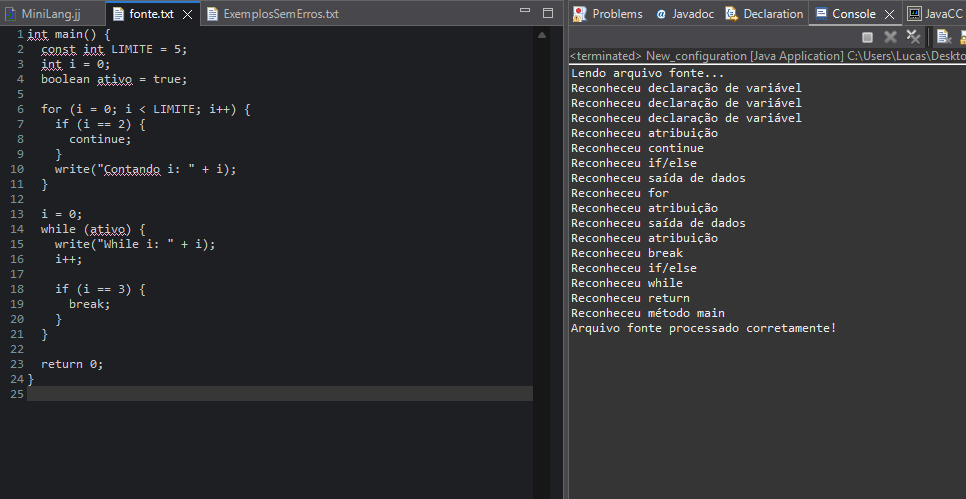
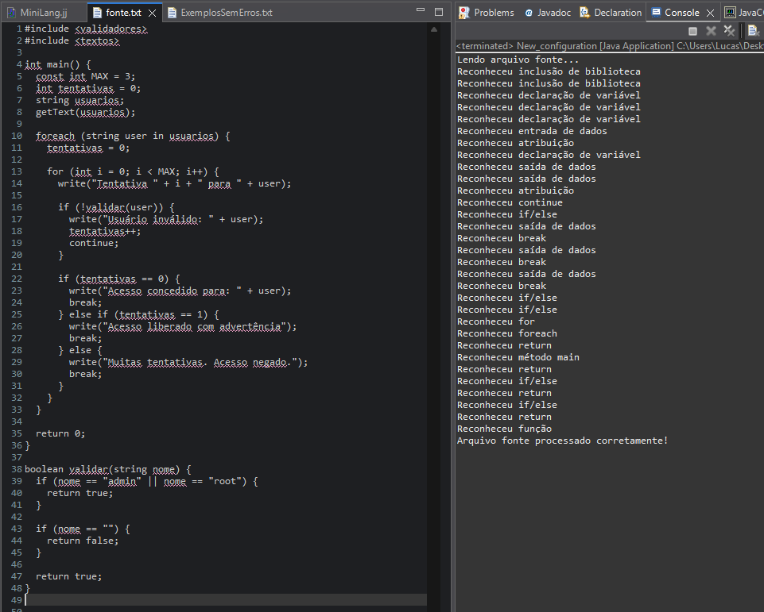
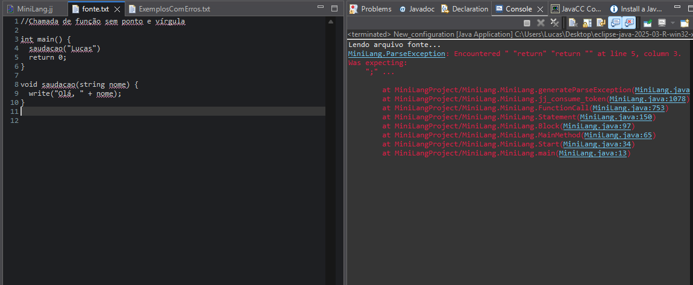
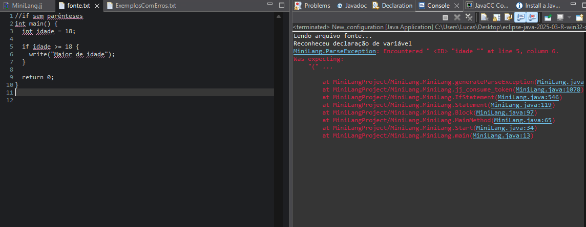

# 🧠 MiniLang – Linguagem de Programação Didática

MiniLang é uma linguagem de programação simples, criada com o objetivo de praticar conceitos de compiladores usando JavaCC. A linguagem é inspirada em linguagens como **C** e **Java**, com sintaxe estruturada, comandos familiares e suporte a expressões aritméticas, lógicas, controle de fluxo, entrada/saída, funções e muito mais.

---

## ✅ Recursos suportados pela linguagem

| Funcionalidade                 | Exemplo comum             | MiniLang suporta? | Como usar em MiniLang                  |
|-------------------------------|----------------------------|-------------------|----------------------------------------|
| Comentários                   | `//`, `/* */`              | ✅                | `// comentário`                        |
| Decisão                       | `if`, `else`               | ✅                | `if (cond) { ... } else { ... }`       |
| Repetição                     | `for`, `while`, `foreach`  | ✅                | `for (...)`, `while (...)`, `foreach`  |
| Declaração de variáveis       | `int`, `text`              | ✅                | `int x = 10;`                          |
| Entrada de dados              | `getInt`, `getText`        | ✅                | `getInt(x);`, `getText(nome);`         |
| Saída de dados                | `write`                    | ✅                | `write("Olá " + nome);`                |
| Funções/procedimentos         | `function abc(int x)`      | ✅                | `int soma(int x, int y) { return ... }`|
| Operadores e separadores      | `+ - * / > < == ; , () {}` | ✅                | Usados normalmente nas expressões      |
| Método principal              | `int main(...)`            | ✅                | `int main() { ... return 0; }`         |
| Inclusão de bibliotecas       | `#include <stdio.h>`       | ✅                | `#include <io>`                        |

---

## 🧾 Como escrever código MiniLang

### 📌 Estrutura básica de um programa

```c
#include <utils>
#include <io>

int main() {
  // Declarações
  int idade;
  getInt(idade);

  if (idade >= 18) {
    write("Maior de idade");
  } else {
    write("Menor de idade");
  }

  return 0;
}
```

### ✍️ Tipos suportados
- **int** – números inteiros
- **string** – textos
- **boolean** – true ou false
- **const** – declaração de constantes

### 🧮 Operadores
- **Aritméticos**: `+`, `-`, `*`, `/`
- **Relacionais**: `==`, `!=`, `<`, `>`, `<=`, `>=`
- **Lógicos**: `&&`, `||`, `!`
- **Outros**: `=`, `++`, `--`

### 🔁 Estruturas de repetição

```c
// FOR
for (int i = 0; i < 5; i++) {
  write(i);
}

// WHILE
while (condicao) {
  // ...
}

// FOREACH
foreach (string nome in nomes) {
  write(nome);
}
```

### 🔂 Decisão condicional

```c
if (condicao) {
  // ...
} else if (outraCondicao) {
  // ...
} else {
  // ...
}
```

### 🔧 Funções

```c
int somar(int a, int b) {
  return a + b;
}

void saudacao(string nome) {
  write("Olá, " + nome);
}
```

---

---

## 🖼️ Exemplos de Execução e Reconhecimento de Comandos

### ✅ Exemplo 1 – Laços `for` e `while`, `continue` e `break`



> Esse código usa um `for` para contar até um limite, pulando o número 2 com `continue`. Em seguida, usa um `while` com `break` quando a variável chega a 3.  
> ✅ O console mostra que todos os comandos foram reconhecidos corretamente: variáveis, laços, operadores, `if`, `break`, `continue`, `return`, etc.

---

### ✅ Exemplo 2 – `foreach`, `funções`, `break`, e validação de entrada



> Esse exemplo mostra um programa mais complexo com `foreach`, funções, múltiplos `break` e validações.  
> A função `validar` aceita apenas alguns nomes. O loop de tentativas limita o número de acessos.  
> ✅ O parser reconheceu corretamente todas as estruturas utilizadas, incluindo múltiplos retornos e chamada de função.

---

### ❌ Exemplo 3 – Erro por falta de ponto e vírgula após chamada de função



> O erro ocorre porque a chamada `saudacao("Lucas")` está sem `;` no final.  
> ❌ O parser acusou erro de parsing: *“Was expecting ;”*.  
> ✅ Isso mostra que a verificação de sintaxe está funcionando corretamente.

---

### ❌ Exemplo 4 – Erro em `if` sem parênteses



> Aqui a estrutura `if idade >= 18` está sem parênteses. A sintaxe correta seria `if (idade >= 18)`.  
> ❌ O erro retornado foi: *“Was expecting (”*.  
> ✅ Esse exemplo reforça que o parser exige a sintaxe correta, igual a linguagens como C e Java.

---


---

## 📌 Regras e observações
- Todos os comandos terminam com `;`
- Blocos de código são delimitados por `{ }`
- Expressões podem ser aninhadas com `()`
- Identificadores não podem começar com números
- Bibliotecas podem (e devem) ser incluídas com `#include <nome>`
- O programa deve começar com `int main() { ... }` (não pode ser `void`)
- Nenhum comando pode ficar fora de funções
- As funções auxiliares devem ser escritas após o `main`

---

## 💬 Relato de aprendizado e dificuldades
Aprendi a estruturar uma gramática usando o JavaCC e a compreender melhor o funcionamento de compiladores, principalmente as fases de análise léxica e sintática. Foi interessante observar como os tokens são definidos e como a ordem das regras pode afetar diretamente o reconhecimento de comandos.

As maiores dificuldades estiveram na implementação e ajuste das expressões, principalmente na inclusão dos operadores aritméticos (`+`, `-`, `*`, etc.) dentro das regras de `Expression()`, pois inicialmente a linguagem só reconhecia expressões lógicas simples. Também foi necessário criar uma estrutura com precedência correta dos operadores e adicionar suporte a chamadas de função dentro de expressões, o que exigiu atenção com ambiguidade nos tokens como `<ID>` e chamadas com `()`.

Outro ponto trabalhoso foi garantir que todos os comandos da linguagem (como `for`, `while`, `foreach`, `break`, `continue`, `if`, `else`, `return`, etc.) fossem testados em conjunto, sem causar conflitos na gramática. Porém, ao final, foi possível montar um interpretador sintático robusto e funcional, cobrindo todos os requisitos propostos.

---

## ▶️ Como rodar o projeto

### 1️⃣ Compilar a gramática
Execute o JavaCC no arquivo `MiniLang.jj` para gerar os arquivos Java do parser:

```bash
javacc MiniLang.jj
```

### 2️⃣ Compilar os arquivos Java

```bash
javac MiniLang.java
```

### 3️⃣ Criar um arquivo `fonte.txt`
Coloque seu código MiniLang dentro do arquivo `src/fonte.txt`.

### 4️⃣ Executar o parser

```bash
java MiniLang
```

Você verá no terminal as mensagens de reconhecimento para cada comando, além da validação do arquivo fonte.

